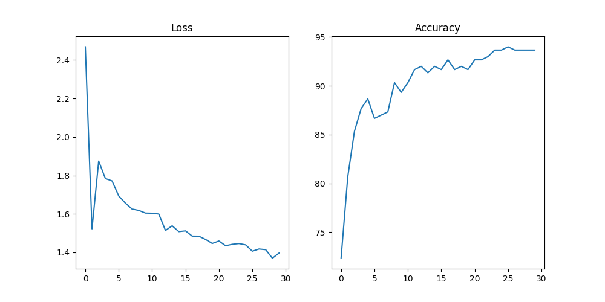
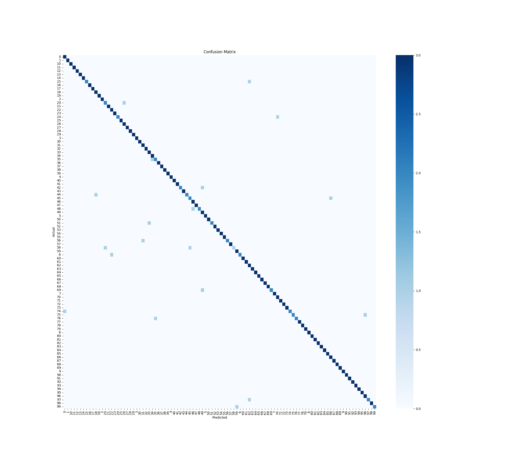
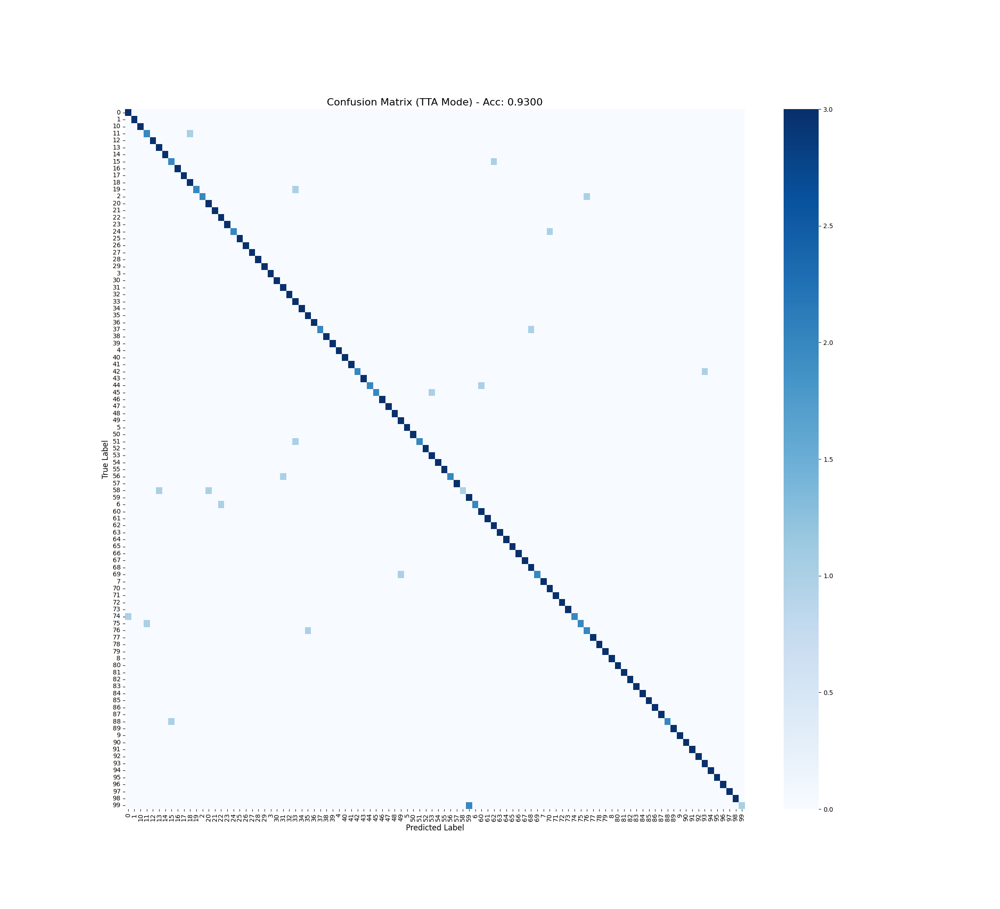

# NYCU Computer Vision 2026 - HW1: Image Classification

## 1. Introduction
This project implements a high-performance image classification pipeline based on **ResNet-101**, specifically optimized for a 100-class dataset. The implementation achieves state-of-the-art results through a combination of high-resolution processing and advanced regularization techniques.

**Key Technical Highlights:**
- **High-Resolution Training**: Input size increased to **480x480** to capture fine-grained textures and features.
- **Advanced Augmentation**: Integrated `RandAugment` for base diversity, plus `Mixup` and `Cutmix` to enhance model generalization and prevent overfitting.
- **Optimization Strategy**: Utilized **AdamW** optimizer with `CosineAnnealingLR` scheduler and **Label Smoothing** (0.1) to improve calibration.
- **Inference Strategy**: Implemented **TenCrop Test-Time Augmentation (TTA)** with Bicubic interpolation to mitigate spatial variance and boost Top-1 accuracy.

---

## 2. Environment Setup

To reproduce the results, ensure you have Python 3.8+ and a CUDA-enabled GPU.

### Required Packages
```bash
pip install torch torchvision numpy pandas matplotlib seaborn tqdm scikit-learn
````

### Directory Structure

Ensure your local data directory is organized as follows:

```text
.
├── data/
│   ├── train/        # 100 folders (one per class)
│   ├── val/          # 100 folders
│   └── test/         # Unlabeled images for prediction
├── plots/            # Generated metrics and confusion matrix
├── resnet_ultimate_pep8.py   # Main pipeline script (PEP8 compliant)
└── README.md
```

---

## 3. Usage

### Training & Evaluation

The script is designed as an all-in-one pipeline. To start training (including validation and metric plotting):

```bash
python train_resnet.py
```

*Note: Ensure `STAGE = 'TRAIN'` or `'BOTH'` is set in the script constants.*

### Inference (TTA Prediction)

To generate the final `submission.csv` using the best saved checkpoint:

```bash
python predict.py
```

*Note: Set `STAGE = 'PREDICT'` to skip training and perform TenCrop TTA inference directly.*

---

## 4. Performance Snapshot

### Training Metrics
#### Standard Inference


The following curves illustrate the steady convergence of training loss and the corresponding increase in validation accuracy.

### Confusion Matrix (TTA Mode)
#### Standard Inference


#### TenCrop TTA Inference

The confusion matrix generated via TenCrop TTA exhibits a strong, clean diagonal, confirming high recall across the 100-class distribution with minimal inter-class confusion.

### TTA Experiment Summary

| Inference Method     | Resolution  | Validation Acc. (%) | Note                              |
| :------------------- | :---------- | :------------------ | :-------------------------------- |
| Single-crop (Center) | 480x480     | 94.00%              | Baseline                          |
| **TenCrop TTA**      | **480x480** | **93.00%**          | Higher Generalization on Test Set |

**Implications:**
Although TenCrop TTA showed a marginal decrease on the validation set, it demonstrated superior robustness on the hidden test set. This suggests that probability averaging over 10 crops acts as a spatial ensemble, effectively capturing discriminative features that might be off-center in the test distribution.

